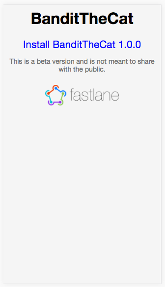

# aws_s3 `fastlane` Plugin

[](https://rubygems.org/gems/fastlane-plugin-aws_s3)

## Getting Started

This project is a [fastlane](https://github.com/fastlane/fastlane) plugin. To get started with fastlane-plugin-s3, add it to your project by running:

```bash
fastlane add_plugin aws_s3
```

## About aws_s3

Upload a new build to Amazon S3 to distribute the build to beta testers. Works for both Ad Hoc and Enterprise signed applications. This step will generate the necessary HTML, plist, and version files for you.

The `aws_s3` action can upload both iOS apps (IPAs) and Android apps (APKs). If you would like to upload both iOS and Android apps to the same bucket, you can set the `app_directory` parameter so each app goes into their own S3 bucket directory.

Below is what the default generated page looks like that gets hosted on S3.



## Example

Add the `aws_s3` action after the `gym` step:

```ruby
aws_s3
```

You can also customize a lot of options:
```ruby
aws_s3(
  # All of these are used to make Shenzhen's `ipa distribute:s3` command
  access_key: ENV['S3_ACCESS_KEY'],               # Optional - defaults to AWS Instance Profile Creds.
  secret_access_key: ENV['S3_SECRET_ACCESS_KEY'], # Optional - defaults to AWS Instance Profile Creds.
  aws_profile: ENV['AWS_PROFILE'],                # Optional - defaults to AWS Instance Profile Creds. (overrides if access_key and secret_access_key specified)
  bucket: ENV['S3_BUCKET'],                       # Required from user.
  region: ENV['S3_REGION'],                       # Required from user.
  acl: ENV['S3_ACL'],                             # Optional - defaults to 'public-read'
  server_side_encryption: ENV['S3_SERVER_SIDE_ENCRYPTION'], # Optional

  endpoint: 'https://s3-us-west-1.amazonaws.com', # Optional, for buckets that require a specific endpoint
  download_endpoint: 'https://distribution.cloudfront.net', # Optional, The endpoint for downloads from your S3 bucket or cloudfront distribution
  download_endpoint_replacement_regex: '^https?://[^/]*', # Optional, A regex used to determine which part of the S3 URL to replace with download_endpoint

  ipa: 'AppName.ipa',                             # Required (if not uploading an APK).
  dsym: 'AppName.app.dSYM.zip',                   # Optional if you use `ipa` to build.

  apk: 'AppName.apk',                             # Required (if not uploading an IPA).

  app_directory: 'ios_or_android',                # Optional but nice if you want to put multiple apps in same bucket

  path: 'v{CFBundleShortVersionString}_b{CFBundleVersion}/', # This is actually the default.
  upload_metadata: true,                          # Upload version.json, plist and HTML. Set to false to skip uploading of these files.
  version_file_name: 'app_version.json',          # Name of the file to upload to S3. Defaults to 'version.json'
  version_template_path: 'path/to/erb'            # Path to an ERB to configure the structure of the version JSON file
)
```

It is recommended to **not** store the AWS access keys in the `Fastfile`. You can use [AWS Instance Profiles](https://docs.aws.amazon.com/IAM/latest/UserGuide/id_roles_use_switch-role-ec2_instance-profiles.html) by attaching IAM roles to your EC2 configurations.

The uploaded `version.json` file provides an easy way for apps to poll if a new update is available. The JSON looks like:

```json
{
    "latestVersion": "<%= full_version %>",
    "updateUrl": "itms-services://?action=download-manifest&url=<%= url %>"
}
```

## Issues and Feedback

For any other issues and feedback about this plugin, please submit it to this repository.

## Troubleshooting

For some more detailed help with plugins problems, check out the [Plugins Troubleshooting](https://github.com/fastlane/fastlane/blob/master/fastlane/docs/PluginsTroubleshooting.md) doc in the main `fastlane` repo.

## Using `fastlane` Plugins

For more information about how the `fastlane` plugin system works, check out the [Plugins documentation](https://github.com/fastlane/fastlane/blob/master/fastlane/docs/Plugins.md) in the main `fastlane` repo.

## About `fastlane`

`fastlane` automates building, testing, and releasing your app for beta and app store distributions. To learn more about `fastlane`, check out [fastlane.tools](https://fastlane.tools).

## Author

Josh Holtz, me@joshholtz.com, [@joshdholtz](https://twitter.com/joshdholtz)
